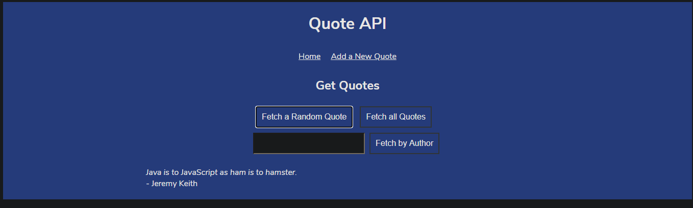

## LIBRARY WITH FIREBASE
The previous project Library from The Odin Project updated to use Firebase cloud database and Firebase Hosting.

## Built With

- HTML 
- CSS
- JAVASCRIPT
- FIREBASE

## Live Demo

[Live Demo Link](https://library-dc5ff.web.app/) :point_left:

## Getting Started
- Follow the live demo link and enjoy the site adding books to it.

### Usage
- To get a local copy up and running follow these simple example steps.

Clone the repository unto your local machine cd to the folder.

### Prerequisites

- A modern browser, up to date.  :muscle:

## Author

👤 Javier Oriol Correas Sanchez Cuesta 
- Github: [@javitocor](https://github.com/javitocor) 
- Twitter: [@JavierCorreas4](https://twitter.com/JavierCorreas4) 
- Linkedin: [Javier Oriol Correas Sanchez Cuesta](https://www.linkedin.com/in/javier-correas-sanchez-cuesta-15289482/) 

## 🤝 Contributing

Contributions, issues and feature requests are welcome!

Feel free to check the [issues page](https://github.com/javitocor/Library-JS-FIREBASE/issues).

## Show your support

Give a ⭐️ if you like this project!

## Acknowledgments 🚀

- Firebase
- The Odin Project
- Google
- Codelabs

## License
MIT LICENSE

